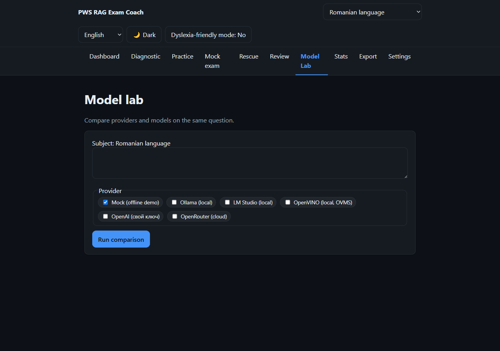

# PWS RAG Exam Coach

> **Turning existing skills into exam points.** A local-first, multilingual,
> adaptive RAG coach that finds the rubric-scored skills currently costing a
> student points and builds a short, explainable path back to the passing
> threshold.


**▶ Live demo: <https://pws-rag-edu.pages.dev/>** &nbsp;·&nbsp; [▶ 2-minute video](https://youtu.be/8T5iniSu80c) &nbsp;·&nbsp;
Built for the **Intel® AI Global Impact Festival 2026**


---

## The problem

Every student in Moldova must pass a Romanian exam to graduate. Students taught in
another language sit a **separate paper — Romanian as a non-native language** —
where the passing margin is often thin; **7,092 ninth-graders registered for it in
2026**. They need targeted practice tied to the official marking scheme, not
another general chatbot that answers plausibly but unverifiably.

## The solution

PWS RAG Exam Coach combines:

- 📚 **RAG grounded in the real curriculum** — feedback retrieves from official
  Ministry-of-Education textbooks (`bge-m3`, 1024-dim, multilingual ru/ro/en),
  cites the chunk it used, and **refuses when local materials lack evidence**.
- 📏 **Scored against the official rubric** — deterministic checks where a computer
  can mark exactly, LLM feedback only where reasoning is needed.
- 🎯 **Rescue Mode** — instead of "everything you should revise", it ranks the
  2–4 partly-mastered skills that can realistically recover the missing points,
  gives micro-drills, and forecasts attainable points rather than promising a score.
- 🔒 **Local-first & private** — all learner data stays in the browser (IndexedDB),
  no account, no real name, only an anonymous local id.
- 🖥️ **Runs without the cloud** — the inference pipeline can run through **Intel
  OpenVINO Model Server** with NNCF-quantized models, keeping student prompts and
  AI responses on the school network.
- 🌍 **EN / RU / RO** interface, light/dark themes, dyslexia-friendly mode,
  keyboard navigation, correct Romanian diacritics.
- 🧩 **Multi-subject by design** — subjects are data + config; adding one needs no
  core code changes.



## Impact so far

During real exam preparation, **112 students at our school had access** to PWS RAG
Exam Coach; **106 passed** the grade-9 Romanian exam for non-native speakers
(94.6%), against an **80.7% national pass rate after the main session** (89.32%
nationally after the August retakes). This compares one school with a whole country
and **cannot isolate the app's effect**: students also had continuous teacher
support, and we deliberately kept equal access rather than create a control group
during a real graduation exam. By design we do not track individual in-app use.

The six students who still needed a retake drove our next step, Rescue Mode: all
six were offered it equally; the two who used it passed, the four who did not did
not. **A promising real-world signal from an honest iteration cycle — not proof of
causality.**

## UN Sustainable Development Goals

| SDG | Role | Why |
|-----|------|-----|
| **SDG 4 — Quality Education** | Primary | Equal access to good preparation for a state graduation exam. |
| **SDG 10 — Reduced Inequalities** | Secondary | Addresses a structural disadvantage of language-minority students; phone-browser access lowers another barrier. |
| **SDG 9 — Industry, Innovation & Infrastructure** | Secondary | Local AI inference for a school without reliable internet or a GPU. |

## Intel technologies

- **OpenVINO Model Server (OVMS)** 2025/2026 — one server, OpenAI/Cohere-compatible
  API for embeddings, reranker, and chat.
- **NNCF** — INT8 weight quantization at export.
- **OpenVINO IR / `optimum-intel`** — HuggingFace → OpenVINO conversion.

Local inference is a **privacy and cost-of-access** choice, not a benchmark claim —
hardware measured so far is Intel CPU.

---

## Quick start

```bash
npm install
npm run seed     # generate subject packs (needs Ollama + bge-m3, else an offline stub)
npm run dev      # http://localhost:5173
```

> **Data packs are not included in this repository.** The per-subject packs
> (`public/packs/*.pack.json` — chunk text + embeddings) and the derived textbook
> chunks (`corpus/out/`) are built from third-party copyrighted textbook material
> and are distributed separately. `npm run seed` regenerates them locally — see
> [`docs/SUBJECT_REGISTRY.md`](docs/SUBJECT_REGISTRY.md). Without them the app runs
> but has no retrieval corpus.

Build & preview:

```bash
npm run build
npm run preview
```

## Scripts

| script | purpose |
|--------|---------|
| `npm run dev` / `build` / `preview` | Vite + PWA |
| `npm run typecheck` | strict `tsc -b` |
| `npm test` | Vitest unit tests |
| `npm run seed` | (re)generate subject packs |
| `npm run eval` | retrieval evaluation harness → `eval/results/` |

## Screens

Onboarding · Subject Dashboard · Diagnostic Test · Practice Session · Mock Exam ·
Rescue Mode · Topic Review · Model Lab · Stats · Export · Settings.

## Documentation

- [docs/ARCHITECTURE.md](docs/ARCHITECTURE.md)
- [docs/SUBJECT_REGISTRY.md](docs/SUBJECT_REGISTRY.md)
- [docs/EVALUATION.md](docs/EVALUATION.md)
- [docs/PRIVACY.md](docs/PRIVACY.md)
- [docs/LLM_PROVIDERS.md](docs/LLM_PROVIDERS.md)
- [docs/DEPLOY_CLOUDFLARE.md](docs/DEPLOY_CLOUDFLARE.md)

## Tech stack

TypeScript · React · Vite · `vite-plugin-pwa` · Dexie (IndexedDB) · i18next ·
Zustand · Vitest. CSS variables for themes; OpenAI-compatible LLM adapter;
`bge-m3` 1024-dim multilingual embeddings via Ollama / OpenVINO Model Server /
Cloudflare Workers AI (with an offline fallback).

## Sources

Official 2026 statistics cited in the video and submission, from ANCE (Agenția
Națională pentru Curriculum și Evaluare) and MEC (Ministry of Education and Research),
Republic of Moldova:

- **7,092** ninth-graders registered for the *Limba și literatura română (alolingvi)*
  exam, session 2026 —
  <https://ance.gov.md/content/încep-examenele-naționale-de-absolvire-gimnaziului-sesiunea-2026>
- **5,996** papers written, **80.7%** pass rate for that exam (preliminary main-session
  results; 82.7% in 2025) —
  <https://mec.gov.md/ro/content/au-fost-anuntate-rezultatele-preliminare-ale-examenelor-de-absolvire-gimnaziului>
- **89.32%** final pass rate for the same subject after the August retake session —
  <https://ance.gov.md/content/au-fost-anunțate-rezultatele-sesiunii-din-august-examenelor-de-absolvire-clasei-ix>
- **3,107** Bacalaureat candidates from minority-language classes, first paper 2 June 2026 —
  <https://ance.gov.md/content/prima-probă-examenului-național-de-bacalaureat-2026-are-loc-astăzi-2-iunie-în-55-de-centre>

Curriculum textbooks: `ctice.gov.md` (Ministry of Education content centre) —
catalogue in [`corpus/manifest.json`](corpus/manifest.json). Embedding model:
`bge-m3` (BAAI). Local inference: Intel OpenVINO, OpenVINO Model Server, NNCF.

## License

[MIT](LICENSE) for the source code. Curriculum textbook content
(`ctice.gov.md`) and ANCE examination materials are the property of their
respective owners and are **not** covered by this license; the data packs built
from them are distributed separately.
