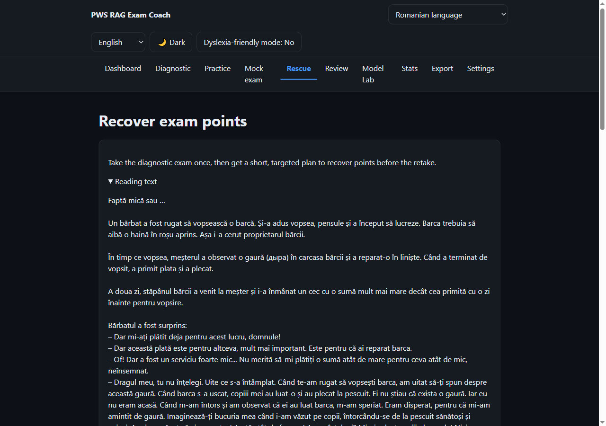

# PWS RAG Exam Coach

> **Turning existing skills into exam points.** A local-first, multilingual RAG
> coach that grades an exam answer against the official rubric, finds the
> rubric-scored skills currently losing points, and builds a short, explainable
> path back to a passing score.


**▶ Live demo: <https://pws-rag-edu.pages.dev/>** &nbsp;·&nbsp; [▶ 2-minute video](https://youtu.be/8T5iniSu80c) &nbsp;·&nbsp;
Built for the **Intel® AI Global Impact Festival 2026**



---

## The problem

Every student in Moldova must pass a Romanian exam to graduate. Students taught in
another language sit a **separate paper — Romanian as a non-native language** —
where the passing margin is often thin; **7,092 ninth-graders registered for it in
2026**. What they need is targeted practice tied to the official marking scheme —
not another general chatbot that answers plausibly but unverifiably.

## What makes this different

This is not a chatbot over a textbook. **RAG retrieves the evidence; the official
exam rubric decides what matters.**

```
exam answer
  → graded against the official ANCE marking scheme
       (deterministic where a computer can mark exactly; LLM only for open-ended criteria)
  → each criterion becomes a "scoring atom" tagged with the skill it tests
  → skills sorted into  🟢 points you already earn reliably
                        🟡 where more points are easiest to find
                        🔴 higher-cost points, set aside for now
  → Rescue Mode builds a route of 2–4 yellow-zone skills, ranked by
       lost points × trainability × transfer reliability ÷ training cost,
       stopping once the projected score clears a margin ABOVE the pass line
  → each skill gets rubric-grounded micro-drills
  → forecast: a conservative figure (counts a skill only after two strong,
       confidently-graded drills in a row) and an expected figure — both capped
       at the points actually lost
```

The skill weights are hand-authored pedagogical estimates, not model output; the
prerequisite ("builds on") graph is authored data. The coach can say *why* a
topic is hard, not just restate it. Terminology and formulas:
[`src/learning/rescueEngine.ts`](src/learning/rescueEngine.ts),
[`rescueConfig.ts`](src/learning/rescueConfig.ts),
[docs/ARCHITECTURE.md](docs/ARCHITECTURE.md).

## Measured validation

`npm run eval` runs a retrieval harness over 56 hand-built golden items across all
seven subjects — including off-topic items and Russian-query-against-Romanian-corpus
items. It measures whether the expected curriculum passage is retrieved, at what
rank, and whether off-topic questions are correctly refused.

| stage | RU-query Recall@5 | RU-query MRR | overall Recall@5 | overall MRR | refusal acc. |
|---|---|---|---|---|---|
| `nomic-embed-text` @768 (before) | 0.625 | 0.358 | — | — | — |
| `bge-m3` @1024 (migration only) | 0.905 | 0.811 | 0.948 | 0.886 | 0.0 (broken) |
| + fixed refusal gate + recalibrated threshold | 0.905 | 0.811 | 0.948 | 0.886 | 0.80 |
| + cross-language query expansion | **0.940** | **0.829** | **0.967** | **0.896** | **0.80** |

Method and the per-language breakdown: [docs/EVALUATION.md](docs/EVALUATION.md).

**An experiment that was rejected.** A cross-encoder reranker
(`bge-reranker-v2-m3` via OpenVINO) was added to sharpen ranking. Measured, it did
not tell relevant from irrelevant text on Cyrillic queries — the exact case the
embedding migration had just fixed. Two likely export-side causes were tested and
ruled out by experiment; a hosted alternative scored worse. The component ships
**disabled by default**. Measure → detect the regression → reject the component.
Detail: [ovms/README.md](ovms/README.md).

## Real-world deployment

Used at one school with grade-9 students during the 2026 exam-preparation period:

- **112 students had access**; **106 passed** the main-session Romanian exam for
  non-native speakers (94.6%). National main-session pass rate for this exam was
  80.7% (89.32% after the August retakes).
- Six students needed the August retake. Rescue Mode — built *because* of that
  feedback — was offered to all six equally; the **2** who used it (confirmed by
  unique-visitor analytics) passed, the **4** who did not, did not.

**What this is not:** no control group, students also had teacher support, and
individual in-app usage is deliberately not tracked. This is evidence of real
deployment and a promising signal — **not** proof the app caused any outcome.
Full write-up, limitations and sources:
[docs/FIELD_DEPLOYMENT.md](docs/FIELD_DEPLOYMENT.md).

## Deployment and scale

| | Clients | Inference | Data path |
|---|---|---|---|
| **Local** | existing PCs / laptops / phones, browser PWA | one server on the school LAN → Intel OpenVINO Model Server → quantized embedding + chat models | student answers stay on the school network |
| **Cloud** (the live demo) | browser PWA | Cloudflare Pages Function proxy → Workers AI (`bge-m3` embeddings) + OpenAI (chat) | prompts leave the network; the UI warns first |

The architecture already supports what matters for scale: clients are ordinary
devices with nothing to install; local mode centralises the AI on one school
server and avoids per-request cloud-API charges (hardware and electricity costs
remain); adding a subject is a corpus-plus-configuration task, not a core-code
change ([docs/SUBJECT_REGISTRY.md](docs/SUBJECT_REGISTRY.md)). Whether one modest
server holds up under a full class's worth of simultaneous requests was measured
with a synthetic concurrency benchmark — next section.

**Privacy.** No account, no real name — identity is an anonymous local id. All
learner data (answers, mastery, metrics) stays in the browser (IndexedDB) and is
never sent anywhere unless the student exports it or opts into a cloud model,
which shows a warning first. Details and the risk table:
[docs/PRIVACY.md](docs/PRIVACY.md), [docs/RESPONSIBLE_AI.md](docs/RESPONSIBLE_AI.md).

## Local inference under concurrent load

To check whether one modest school server can support shared classroom use, we ran
a **synthetic concurrency benchmark** against the actual OVMS deployment — the
generation model (`OpenVINO/Qwen3-4B-int4-ov`, INT4) served over
`/v3/chat/completions` — on an **Intel Xeon E5-2678 v3**, a 2014 Haswell-EP CPU
with AVX2 but without AVX-512 or VNNI available on newer server CPUs. Load was
generated from a **separate computer on the same LAN**; the Xeon did inference
only. Every request asked for a fixed 30 completion tokens
at `temperature 0`.

| Concurrency | Success | p50 latency | p95 latency | Requests/s | Aggregate gen tok/s |
|---:|---:|---:|---:|---:|---:|
| 1  | 10 / 10  | 1.43 s | 1.86 s | 0.68 | 20.5 |
| 5  | 25 / 25  | 3.47 s | 4.94 s | 1.35 | 40.5 |
| 10 | 50 / 50  | 4.53 s | 5.34 s | 2.15 | 64.6 |
| 20 | 100 / 100 | 5.91 s | 11.54 s | 2.58 | 77.3 |

At **concurrency 20 all 100 measured requests completed** — zero failures, zero
timeouts. Aggregate end-to-end generation throughput rises from ~20 to ~77
tokens/s as concurrency goes 1 → 20; latency rises with it (p95 1.86 s → 11.54 s).
That is an honest capacity/latency trade-off, not something to hide.

This is a **synthetic infrastructure test, not a physical 20-PC classroom trial**,
and it does not measure UX quality for 20 simultaneous students. It shows that the
local OpenVINO / OVMS pipeline stays operational under classroom-scale concurrent
load even on old, non-AI-optimised CPU hardware. Method, raw per-request records
and the full environment:
[`eval/results/intel-xeon-e5-2678v3-concurrency/summary.md`](eval/results/intel-xeon-e5-2678v3-concurrency/summary.md).

## Intel / OpenVINO

OpenVINO is an engineering choice, not a logo. A state exam for students without
reliable internet, in schools that may not want answers leaving the building,
needs an inference path that is private, runs on a plain CPU, and carries no
cloud subscription. That is what the local path is for.

Present in this repository (verified):

- **OpenVINO Model Server** — one container, one port, all three RAG stages
  behind an OpenAI-/Cohere-compatible API.
- **NNCF** — INT8 weight compression at export.
- **OpenVINO IR** / **`optimum-intel`** — model conversion (`ovms/tools/`).

### Validation status

| Component | Status |
|---|---|
| OVMS serving all three stages (embeddings + rerank + chat), end to end | functionally validated — on **x86-64 CPU (AMD)**, the dev machine |
| OVMS chat serving on an **Intel Xeon E5-2678 v3 (CPU)** | measured — 185 requests over a 1 → 20 concurrency sweep, 0 failures / 0 timeouts (see *Local inference under concurrent load*) |
| INT8 `bge-m3` vs FP baseline (10 ru/ro/en probes) | measured — worst-case cosine 0.9995 (on AMD) |
| Qwen3 chat latency fix (`enable_thinking: false`) | measured — 12.2 s → 6.3 s (on AMD, a separate single-request A/B) |
| Cross-encoder reranker on Cyrillic | measured — regression, not shipped |
| Intel Arc GPU | not yet run — needs a `--target_device GPU` re-export |
| Intel NPU | not applicable — no NPU on available hardware |
| Physical multi-PC classroom trial | not done — the concurrency numbers above are synthetic (one load generator) |

The concurrency sweep is the one measurement taken on Intel silicon; the
embedding-quality and thinking-mode figures were taken on an AMD CPU. Full detail
and reproduction: [docs/INTEL_OPENVINO.md](docs/INTEL_OPENVINO.md).

## How the project evolved

| Step | What it added |
|---|---|
| General educational RAG | grounded, cited feedback over curriculum text |
| Exam-specific scoring | grading against the official ANCE marking scheme |
| Explicit skill tags | every rubric criterion tagged with the skill it tests |
| Diagnostic zones | 🟢 / 🟡 / 🔴 sorting of skills by recoverable value |
| Rescue Mode | a ranked route of 2–4 skills to the points needed to pass |
| Points forecast | conservative vs expected recovered-points estimate — capped, advisory |
| Retake-driven iteration | Rescue Mode was built in response to six real retake cases (2026) |

The innovation is not RAG. It is using the **official scoring rubric** to turn
grounded AI feedback into a targeted path for recovering the exam points a student
can realistically still earn.

## UN Sustainable Development Goals

| SDG | Role | Why |
|---|---|---|
| **SDG 4 — Quality Education** | Primary | Equal access to good preparation for a state graduation exam. |
| **SDG 10 — Reduced Inequalities** | Secondary | A structural disadvantage of language-minority students; phone-browser access lowers another barrier. |
| **SDG 9 — Industry, Innovation & Infrastructure** | Secondary | Local AI inference for a school without reliable internet or a GPU. |

---

## Quick start

```bash
npm install
npm run seed        # generate subject packs (needs Ollama + bge-m3, else an offline stub)
npm run seed:demo   # optional: synthetic corpora for chemistry / math / russian
npm run dev         # http://localhost:5173
```

> **Data packs are not included in this repository.** The per-subject packs
> (`public/packs/*.pack.json` — chunk text + embeddings) and the derived textbook
> chunks (`corpus/out/`) are built from third-party copyrighted textbook material
> and are distributed separately.
>
> `npm run seed` regenerates them locally. **Biology, English, History and
> Romanian** ship with a small hand-authored fallback chunk set
> (`src/data/chunks/*.chunks.ts`) and seed to a usable pack with no extra steps.
> **Chemistry, Mathematics and Russian** have no public corpus — they are empty
> after a clean clone until you either regenerate them from local textbook PDFs
> (see [docs/SUBJECT_REGISTRY.md](docs/SUBJECT_REGISTRY.md)) or run
> `npm run seed:demo`, which fills just those three with clearly-labelled
> self-authored synthetic content. The app shows an explicit "no knowledge base
> in this build" notice for an empty subject. Full walkthrough:
> [docs/JUDGE_REPRODUCIBILITY.md](docs/JUDGE_REPRODUCIBILITY.md).

```bash
npm run build && npm run preview
```

> **AI provider on the first run.** Onboarding starts on **Mock (offline demo)** —
> deterministic, on-device, zero setup — for `npm run dev` and `npm run preview`.
> It switches the initial pick to the same-origin **cloud proxy** only when a
> *configured* `/api/v1` is actually detected (the deployed site, or
> `npm run build && npm run cf:dev` with `.dev.vars` — see
> [docs/DEPLOY_CLOUDFLARE.md](docs/DEPLOY_CLOUDFLARE.md)). You can pick any local
> provider (Ollama / LM Studio / OpenVINO, if that server is running) or the
> cloud proxy yourself in onboarding or Settings; cloud options always show a
> data-egress warning first. Details:
> [docs/LLM_PROVIDERS.md](docs/LLM_PROVIDERS.md).

## Scripts

| script | purpose |
|--------|---------|
| `npm run dev` / `build` / `preview` | Vite + PWA |
| `npm run typecheck` | strict `tsc -b` |
| `npm test` | Vitest unit tests |
| `npm run seed` | (re)generate subject packs (public / production) |
| `npm run seed:demo` | seed + synthetic demo corpora for the 3 empty subjects |
| `npm run eval` / `eval:ci` | retrieval evaluation harness / deterministic CI gate |
| `npm run verify:embeddings` | check two embedding backends share a vector space |

## Screens

Onboarding · Subject Dashboard · Diagnostic Test · Practice Session · Mock Exam ·
Rescue Mode · Topic Review · Model Lab · Stats · Export · Settings.

## Tech stack

TypeScript · React · Vite · `vite-plugin-pwa` · Dexie (IndexedDB) · i18next ·
Zustand · Vitest. `bge-m3` 1024-dim multilingual embeddings via Ollama /
OpenVINO Model Server / Cloudflare Workers AI, with an offline fallback;
OpenAI-compatible LLM adapter.

## Evidence and technical documentation

| | |
|---|---|
| Architecture | [docs/ARCHITECTURE.md](docs/ARCHITECTURE.md) |
| Evaluation & metrics | [docs/EVALUATION.md](docs/EVALUATION.md) |
| Field deployment (2026) | [docs/FIELD_DEPLOYMENT.md](docs/FIELD_DEPLOYMENT.md) |
| Responsible AI | [docs/RESPONSIBLE_AI.md](docs/RESPONSIBLE_AI.md) |
| Intel OpenVINO deployment | [docs/INTEL_OPENVINO.md](docs/INTEL_OPENVINO.md) |
| Local OVMS setup & the reranker limitation | [ovms/README.md](ovms/README.md) |
| Privacy | [docs/PRIVACY.md](docs/PRIVACY.md) |
| LLM providers | [docs/LLM_PROVIDERS.md](docs/LLM_PROVIDERS.md) |
| Cloud deployment | [docs/DEPLOY_CLOUDFLARE.md](docs/DEPLOY_CLOUDFLARE.md) |
| Adding a subject | [docs/SUBJECT_REGISTRY.md](docs/SUBJECT_REGISTRY.md) |
| Judge / clean-clone reproducibility | [docs/JUDGE_REPRODUCIBILITY.md](docs/JUDGE_REPRODUCIBILITY.md) |
| Russian-language retrieval status | [docs/RUSSIAN_LANGUAGE_STATUS.html](docs/RUSSIAN_LANGUAGE_STATUS.html) |
| Corpus provenance | [`corpus/manifest.json`](corpus/manifest.json) |
| Live demo | <https://pws-rag-edu.pages.dev/> |
| Video | <https://youtu.be/8T5iniSu80c> |

## Sources

Official 2026 statistics cited above and in the video, from ANCE (Agenția
Națională pentru Curriculum și Evaluare) and MEC (Ministry of Education and
Research), Republic of Moldova:

- **7,092** ninth-graders registered for the *Limba și literatura română
  (alolingvi)* exam, session 2026 —
  <https://ance.gov.md/content/încep-examenele-naționale-de-absolvire-gimnaziului-sesiunea-2026>
- **5,996** papers written, **80.7%** pass rate (preliminary main-session; 82.7%
  in 2025) —
  <https://mec.gov.md/ro/content/au-fost-anuntate-rezultatele-preliminare-ale-examenelor-de-absolvire-gimnaziului>
- **89.32%** pass rate for the same subject after the August retake session —
  <https://ance.gov.md/content/au-fost-anunțate-rezultatele-sesiunii-din-august-examenelor-de-absolvire-clasei-ix>
- **3,107** Bacalaureat candidates from minority-language classes, first paper
  2 June 2026 —
  <https://ance.gov.md/content/prima-probă-examenului-național-de-bacalaureat-2026-are-loc-astăzi-2-iunie-în-55-de-centre>

Curriculum textbooks: `ctice.gov.md` (Ministry of Education content centre) —
catalogue in [`corpus/manifest.json`](corpus/manifest.json). Embedding model:
`bge-m3` (BAAI). Local inference: Intel OpenVINO, OpenVINO Model Server, NNCF.

## License

[MIT](LICENSE) for the source code. Curriculum textbook content (`ctice.gov.md`)
and ANCE examination materials are the property of their respective owners and are
**not** covered by this license; the data packs built from them are distributed
separately.
